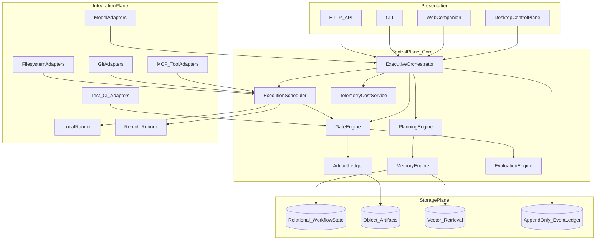

# Forge Council — System Architecture

**SSoT:** Durable structural truth for the product. Execution detail lives in `PLAN.md` and `RUNBOOK.md`.

---

## 1. Architectural style

**Hybrid modular monolith (control plane) + isolated execution runners.**

- The **control plane** owns workflow state, gates, memory orchestration, artifact ledger metadata, scheduling, and observability aggregation.
- **Runners** execute tool-using work (agents, scripts, CI) in **isolated** environments with **declared mounts** (workspace roots only, no broad host access).

This maximizes shipping speed for MVP while preserving hard boundaries around execution and secrets.

## 2. Logical layers

## 3. Repository layout (this monorepo)

| Area | Purpose |
|------|---------|
| `_system/` | AIAST agent OS (generic); **must not** be imported by runtime code. |
| `_system/forge-council/` | Forge-specific roles, policies, skills, templates, schemas. |
| `schemas/forge_council/v1/` | JSON Schema for orchestration payloads (SSoT for validators). |
| `src/forge_council/` | Control-plane **runtime** library (models, OTel helpers); no imports from `_system/`. |
| `bootstrap/fc-*.sh` | Operator and CI-facing automation for ingestion, gates, resume export. |
| Root canonical docs | `PRD.md`, `ARCHITECTURE.md`, `DATA_MODEL.md`, `NFR.md`, `RUNBOOK.md`, `GPT54.md`. |

**Boundary rule:** `src/forge_council` may read **paths** to docs and schemas as configured by the operator; it does not embed `_system` as Python modules.

## 4. Agent topology (supervisor / subagent)

**Leadership:** Executive/Boss, Planner, Planner Review/Challenger.  
**Workers:** Primary Builder, Secondary Builder, Tester, Debugger/Integrator, Reviewer/Security.

Orchestration follows **supervisor routing**: subagents receive **task packets** and **read-only context slices**; they return **artifacts** and **structured summaries**. No unbounded peer mesh.

Role contracts: `_system/forge-council/roles/`. Cross-reference: `_system/AGENT_ROLE_CATALOG.md`.

## 5. State machine (orchestration)

States: Intake → ContextCapture → RepoIngestion → ConflictScan → BlueprintDraft → BlueprintReview → MilestonePlan → ApprovalGate → PacketGeneration → ExecutionDispatch → ValidationGate → ReviewGate → AcceptRejectSplit → ResumeArchiveExport.

Transitions persist to relational store + append-only **ledger**; payloads validate against `schemas/forge_council/v1/` where defined.

## 6. Technology choices (MVP)

| Concern | Choice |
|---------|--------|
| Control plane service (future) | Python 3.12+, FastAPI or equivalent (decision gate before first networked release) |
| Desktop shell (future) | Tauri or Qt — deferred until control plane API stable |
| DB | SQLite for dev; PostgreSQL for multi-user (M11+) |
| Object storage | Local filesystem → S3-compatible optional |
| Vector retrieval | Pluggable; start with file-backed or sqlite-vss; optional external service |
| Telemetry | OpenTelemetry SDK; OTLP exporter configurable |

## 7. Integration: models and MCP

- **Model adapters** normalize chat/completions/responses-shaped APIs behind a small interface (`generate`, `generate_structured`, `embed`).
- **MCP** tools registered per workspace with **capability manifest** and **policy binding** (`tool_policy.md`).

## 8. Multi-runner fabric (M8+)

Uniform **scheduler contract**: job spec (image/command, env, mounts, secrets refs, resource limits), cancellation, log streaming, exit artifacts. **Local**, **self-hosted**, and **remote** runners implement the same interface.

## 9. Security architecture summary

See `NFR.md` and `_system/forge-council/policies/`. Principles: repo-local precedence, instruction conflict scan before execution, allowlisted tools, path-scoped FS, branch-scoped git, human approval for destructive ops, per-project memory isolation, redacted telemetry.

## 10. Evolution

M0–M4: docs, ingestion, blueprints, packets.  
M5–M7: execution, gates, memory/resume.  
M8–M12: runners, evaluation, release hardening, team governance, extensions.

Details: `ROADMAP.md` and `EXTENSION_ROADMAP.md`.
